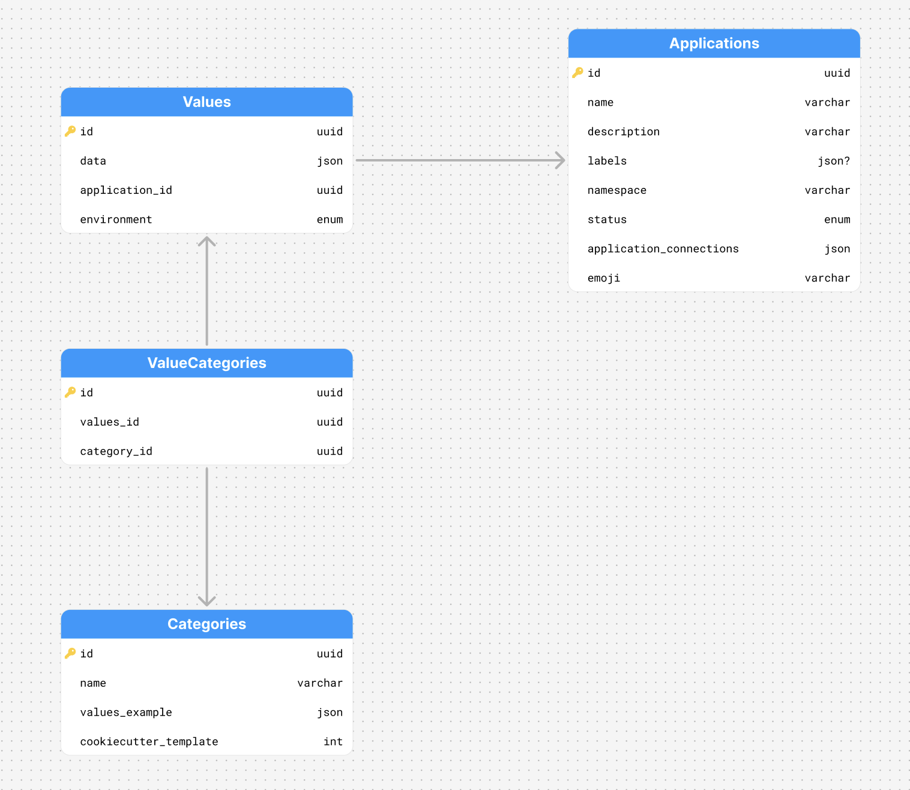
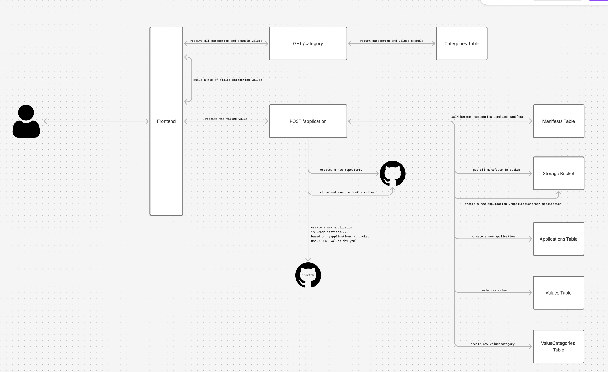

# pond-4-m10-comp

## Introdução
Olá professor, por via desse documento venho mostrar a minha atividade ponderada desenvolvida.
Antes de contar o porque criei essa plataforma, queria antes contar qual é o meu papel dentro da empresa. 
Atualmente atuo como Cloud/Plataform Engineer em uma Startup Fintech daqui de São Paulo, o meu papel envolve desde a arquitetura e implementação da nossa infra, quanto a melhora da plataforma e vida do desenvolvedor.

Minha ideia para essa atividade foi unir o útil ao agradável, isto é, montar uma POC de uma IDP. Uma Internal Developer Plataform, conhecida como IDP, é um dos conceitos centrais de Plataform Engineering, que agrupa recursos e funcionalidades que façam com que o Desenvolvedor, especialista em Segurança e DevOps, consiga testar e trabalhar sem gargalo algum.
Suas funcionalidades incluem:

1. Catálogo de Serviços - Uma visão geral dos microserviços implementados, combina uma visão de arquitetura somado ao monitoramento dos serviços. Posteriormente, incluirá um "Self-Service", na criação de novos microserviços, em um esquema de forms para preencher dependências.

2. Detalhes - Ao clicar em um serviço do catálogo, você terá informações extras dele. As informações mostradas incluem:
- Repositório respectivo daquele serviço
- Business Unit
- Pipelines CI/CD
- Ambiente
- Saúde
- Documentação
- Versão rodando e release respectiva
- Contribuidores
- Dependências externas
- Worktrees ativas

3. Worktrees - Implementa uma funcionalidade interna da empresa, o conceito envolve a criação de replicas "bobas" dos microserviços, permitindo o Desenvolvedor a testar um serviço em específico, sem atrapalhar um outro Desenvolvedor testando aquele mesmo serviço!

## Vídeo
https://youtu.be/tX1VBvxOsEA

## Implementação
Entrando mais a fundo na implementação, escolhi as tecnologias de mobile Swift UI e de backend FastAPI (python). A escolha das tecnologias foi baseada puramente em conseguir gerar valor mais rapidamente, priorizando por um desenvolvimento rápido, mas conciente que pode ser escalado, obdecendo ao Clean Code em ambos os fins. 

Decisões tomadas no Mobile:
- Canvas + TimelineView para o mapa galáctico (estrelas, órbitas de cometas, linhas de constelação) — render imperativo e animação por tempo sem recriar views.
- AppKit via @NSApplicationDelegateAdaptor (AppDelegate) para inicialização que exige app já lançado.
- UserNotifications para notificações locais.
- UserDefaults para persistir worktrees ativos entre sessões.

Decisões tomadas no Backend:
- Organização em camadas próprias da empresa
- Utilização de módulos compatilháveis, shared; ValidationError(Exception)
- Uso das APIs externas; Kube Server e GitHub API

## Decisões arquiteturais
Sobre algumas decisões arquiteturais que tomei, decidi optar por pegar os dados do GitHub síncronamente e sem persistir no banco de dados. Essa decisão pelo valor gerado por cada leitura, em um banco de dados da empresa esse custo seria muito pouco, mas adicionaria custo. Por outro lado, a API do GitHub tem um free tier excessivamente grande, que permite esse uso exagerado dela em runtime da aplicação. 
A autenticação na API do Kubernetes é feito por Workload Identiy, por isso a falta de chaves e variáveis de ambiente no backend. Esse aproach é justamente, fazer um binding entre a Service Account utilizada no Kubernetes, com a do Google Cloud, que mistura as permissões de ambas em duas entidades:
1. Quando a KSA pedir algo a API do GCP, personificará a GSA
2. Quando a GSA pedir algo a API do Kubernetes, personificará a KSA

Implementei junto, outros padrões de qualidade da empresa, que acho válido ser contado na ponderada. Coisas como, conteinerização com Docker, pipeline CI (testes, linter, build e push da imagem), criação de manifestos Kubernetes, e deploy automatizado com ArgoCD x Image Updater.

## Features Extras
Existem 2 principais features extras que produzi para essa atividade:
1. Sistema de notificações - Sempre que uma Worktree é criada, uma notificação é enviada no sistema para todos usuários com o Cosmos pelo menos em Backgroud.
2. Menu Bar - Implementação do ArgoCD Health Monitor, que permite a equipe de Site Reliability Engineer monitorar as Applications, sua saúde e estado de sincronização.

## Dificuldades
Durante o desenvolvimento da atividade, tive dois grandes impedimentos, um relacionado a um erro bobo as notificações e sobre a implementação com a integração do Kubernetes. Sobre o erro bobo da notificação, foi realmente muito juvenil, no inicio da aplicação do XCode, a aplicação pedia para habilitar as notificações nos Settings. Só que eu não vi, ficou no cache e fiquei aproximadamente um milhão de anos tentando debbugar algo que era só ativar nas notificações.
Sobre a integração com a API do Kubernetes, tive uma dificuldade em implementar, pois eu não sabia o que eu queria exatamente. A API é bem documentada, só que além de eu usar plugins que não estão na docs oficial, eu ainda ficava em dúvida em que rota exatamente eu deveria coletar os dados

## Planejamento
Antes de fazer a ponderada, fiquei ponderando sobre como deveria fazer a lógica do catálogo e criação, por isso produzi duas imagens no figma, que me levaram bastante tempo matutando o fluxo:
1. ERD - Banco de Dados

2. Fluxo de POST de um novo microserviço (Self-Service)

## Como a atividade cumpre os requisitos?
1. Aplicação mobile desenvolvida em Kotlin, SwiftUI, Flutter ou tecnologia equivalente - Utilizei SwifitUI
2. Mais de duas telas implementadas - Telas de catálogo de serviços, detalhes de serviços e worktrees
3. Banco de dados utilizado para persistência - Utilização do AlloyDB para persistência dos dados
4. Consumo de pelo menos uma API externa - GitHub e Kubernetes
5. Sistema de notificações implementado - Implementado na criação de worktrees
6. Uso de pelo menos um recurso de hardware do celular - Utilizei o "hardware" do MacOs, com o menu bar do ArgoCD Health Monitor
7. Interface organizada e coerente com a proposta da aplicação - Proposta clara e intuitiva
8. Tratamento básico de erros, carregamentos e respostas da API - Módulos shared de exceptions e DTOs (schemas)
9. Documentação mínima explicando a proposta, tecnologias utilizadas e instruções de execução - Documentação atual
10. Vídeo ou demonstração funcional da aplicação - Vídeo encontrado na documentação
11. Código-fonte organizado em repositório - Conversado com o professor Murilo, sobre o fato de ser um código empresarial, não pode ser divulgado.